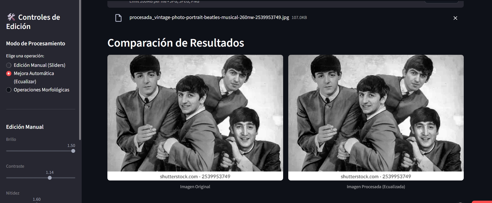

# 🚀Track 2: Restauración y Enhancement con Inteligencia Artificial

> **Trabajo Integrador Final 2 - Ingeniería de IA Generativa** > _Un sistema MVP para democratizar el procesamiento digital de imágenes mediante validación semántica._

---

## 🔗 Enlaces del Proyecto

| Recurso                | Estado    | Enlace                                                                                            |
| :--------------------- | :-------- | :------------------------------------------------------------------------------------------------ |
| **Aplicación en Vivo** | 🟢 Online | [👉 Abrir RetroLens AI (Streamlit Cloud)] https://editor-ia-f37sq6eikp243v3gamzptq.streamlit.app/ |
| **Código Fuente**      | 📂 GitHub | [👉 Ver Repositorio] https://github.com/orlandoVergara/editor-ia                                  |
| **Documentación**      | 📄 README | [👉 Ver Detalles Técnicos] https://github.com/orlandoVergara/editor-ia/blob/main/README.md        |

---

## 📝 Descripción Profesional

**RetroLens AI** es una aplicación web interactiva diseñada para resolver un problema común en la digitalización de archivos: la pérdida de calidad visual en fotografías antiguas escaneadas.

El sistema integra un pipeline de **Procesamiento Digital de Imágenes (Pillow)** para operaciones de bajo nivel (filtrado, histogramas) con un modelo de **Lenguaje y Visión (Gemini 1.5 Flash)** para análisis de alto nivel.

A diferencia de los filtros automáticos tradicionales ("caja negra"), esta solución se basa en principios de **Human-AI Interaction (HAI)**: prioriza el control manual del usuario y utiliza la IA como un consultor experto que valida si los cambios realizados (brillo, contraste, nitidez) representan una mejora objetiva en la calidad de la imagen.

---

## 📸 Galería de Funcionalidades (Screenshots)

### 1. Edición Manual y Control Total

El usuario ("Laura") puede ajustar parámetros de intensidad y filtros de realce. La interfaz bloquea opciones conflictivas para prevenir errores.

!![[Captura de Edición Manual]](assets/edicion_manual.png)
_Interfaz de usuario mostrando sliders de Brillo, Contraste y Nitidez._

### 2. Restauración Automática 

Implementación de `ImageOps.equalize` para corregir fotos con mala iluminación o "efecto niebla" en un solo clic.

_Comparativa: Imagen original opaca vs. Imagen procesada con histograma ecualizado._

### 3. Validación Semántica con Gemini 1.5

La característica estrella. La IA analiza el "antes y después" y genera un reporte en lenguaje natural sobre la calidad de la edición.

_El modelo multimodal confirma: "La nitidez ha mejorado los bordes sin introducir ruido excesivo"._

---

## 🛠️ Stack Tecnológico y Arquitectura

El proyecto sigue una arquitectura cliente-servidor simplificada para despliegue rápido.

- **Frontend/Backend:** `Streamlit` (Python).
- **Motor de Procesamiento:** `Pillow (PIL)` para manipulación de matrices de píxeles (rápido y eficiente en CPU).
- **Inteligencia Artificial:** `Google Generative AI SDK` conectando con el modelo **Gemini 1.5 Flash**.
- **Despliegue:** Streamlit Community Cloud con gestión de secretos (`secrets.toml`) para seguridad de API Keys.

---

## 🎯 Cumplimiento de Objetivos de Aprendizaje

Este proyecto demuestra la adquisición de las siguientes competencias:

1.  **Diseño de MVP centrado en el usuario:**

    - Diseñado para el perfil "Laura" (fotógrafa amateur), priorizando la simplicidad y la retroalimentación visual sobre la complejidad técnica.

2.  **Aplicación de conceptos de procesamiento digital:**

    - Implementación exitosa de **Transformaciones de Intensidad** (Brillo/Contraste), **Filtros de Realce** (Sharpening) y **Ecualización de Histogramas**.
    - Inclusión de **Operaciones Morfológicas** (Erosión/Dilatación) para tareas de corrección estructural.

3.  **Combinación de tecnologías de IA:**

    - Integración de modelos multimodales (Visión + Texto) para reemplazar pipelines de difusión complejos, optimizando el rendimiento en entornos sin GPU.

4.  **Principios de Human-AI Interaction:**

    - **Visibilidad del estado:** Uso de indicadores de carga (`spinners`) durante la inferencia de la IA.
    - **Control:** La IA se invoca bajo demanda (botón) y no interrumpe el flujo de trabajo manual.

5.  **Despliegue y Seguridad:**
    - Aplicación desplegada públicamente con gestión correcta de variables de entorno y `.gitignore` para proteger credenciales sensibles.

---

### 👤 Autor

**Orlando Vergara**
_Estudiante del instituto IFTS_

